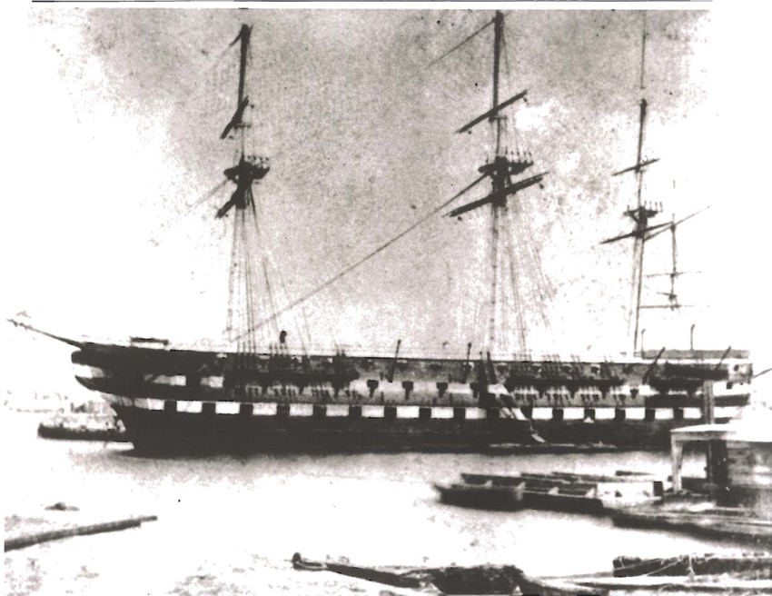
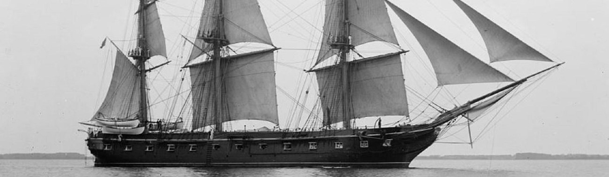

Although the surviving record reveals only limited details about John Comfort’s personal life, enough evidence remains to sketch the outlines of his service and later life.

<h2>Basic Information</h2>

<ul>

<li>Born: China, potentially 1845</li>

<li>Service: Union Navy</li>

<li>Enlisted: September 27, 1864</li>

<li>Discharged: October 26, 1866</li>

</ul>

<h2>Early Life</h2>

Little is currently known about Comfort’s early life before his enlistment. Surviving records suggest that he was born in China, possibly around 1845, but they do not yet provide much detail about his family background, childhood, or migration to the United States. This absence is itself revealing, reflecting the fragmentary way Chinese lives often entered nineteenth-century American archives.

<h2>Military Service</h2>

John Comfort enlisted in the Union Navy on September 27, 1864, at the age of nineteen. He served for two years before being discharged on October 26, 1866. Records show that he served as a landsman aboard the U.S.S. <em>North Carolina</em>, the U.S.S. <em>Seneca</em>, and the U.S.S. <em>Constellation</em>.

Although the exact dates of his transfers between ships remain unclear, the histories of these vessels help place his service in context.

By the time Comfort served aboard the U.S.S. <em>North Carolina</em>, the ship was functioning as a receiving ship rather than an active war vessel, suggesting that it may have served as an entry point in his naval experience.

The U.S.S. <em>Seneca</em>, a wooden-hulled gunboat launched in 1861, served with the North Atlantic Blockading Squadron. During the period of Comfort’s service, the <em>Seneca</em> participated in major operations against Fort Fisher in late 1864 and early 1865, and later helped in the attack and capture of Fort Anderson in February 1865. If Comfort was aboard during this period, he would have been connected to some of the Navy’s important late-war campaigns along the Atlantic coast.

Comfort also served aboard the U.S.S. <em>Constellation</em>, the last all-sail ship built by the United States Navy. Commissioned in 1855, the <em>Constellation</em> had already established a long service history by the time Comfort joined its crew. The ship is remembered both for its Civil War-era service and for its earlier role in suppressing the foreign slave trade.

<h2>Postwar Life</h2>

After the war, Comfort’s life appears to have taken him across the Pacific world. He married Au Kung Ling in Hong Kong in 1878. By 1895, he was living in New York City, suggesting that he had returned to the United States by the late nineteenth century. Together, John and Au Kung Ling had a daughter, Tai Kau, who was born on July 27, 1899. Comfort died on April 6, 1907.

<h2>Historical Significance</h2>

John Comfort’s story highlights both the possibilities and the limitations of the historical record for recovering Chinese participation in the Civil War. Like many of the men in this project, he survives only in scattered traces across enlistment records, family records, and later documentation. Yet even these fragments reveal important patterns. His naval service shows that Chinese-born men were present within Union military institutions, while his later life in Hong Kong and New York points to the transnational dimensions of Chinese experience in the nineteenth century. Comfort’s life therefore helps illuminate the broader connections among migration, military service, and belonging in this era.

<h2>Sources</h2>

<ul>

<li><a href="https://www.ancestrylibrary.com/search/collections/62282/records/4366984706">"Comfort Families in America"</a></li>

<li><a href="https://www.ancestrylibrary.com/search/collections/60368/records/181063?tid=&pid=&queryId=d78fac96-caa5-4f21-80c1-2d956efacefb&usePUBJs=true&_gl=1*h0oxqa*_up*MQ..*_ga*MTA4NDI2NDg2My4xNzczNzA5Nzk5*_ga_4QT8FMEX30*czE3NzM3OTAzNDUkbzQkZzEkdDE3NzM3OTAzNTUkajUwJGwwJGgw*_ga_LMK6K2LSJH*czk2ZWQxNTljLWY4OTItNDMyZi05YTY3LWRjYWI0M2Y3MmEyYiRvMSRnMCR0MTc3MzcwOTc5OSRqNjAkbDAkaDA.">Weekly return of enlistments at Naval Rendezvous ("Enlistment Rendezvous"), Jan. 6, 1855-Aug. 8, 1891</a></li>

</ul>
