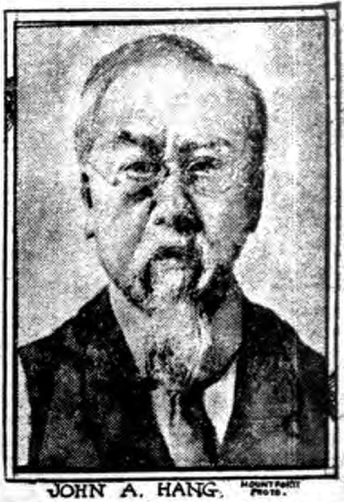
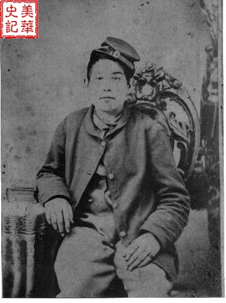
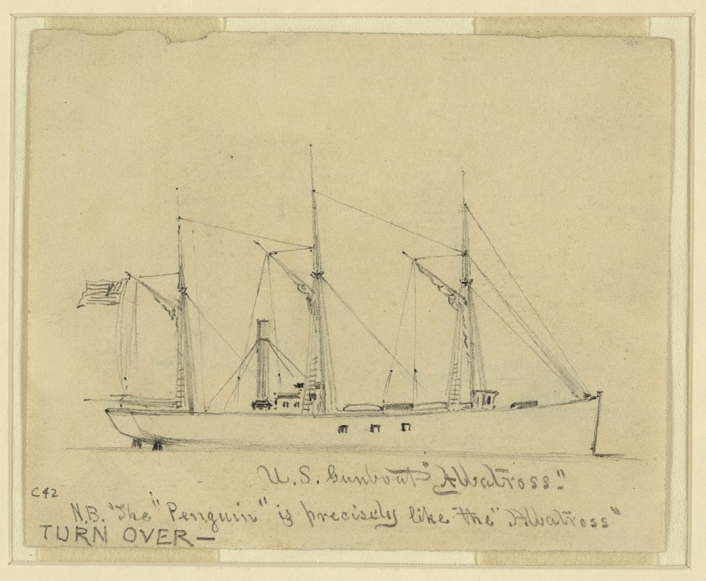
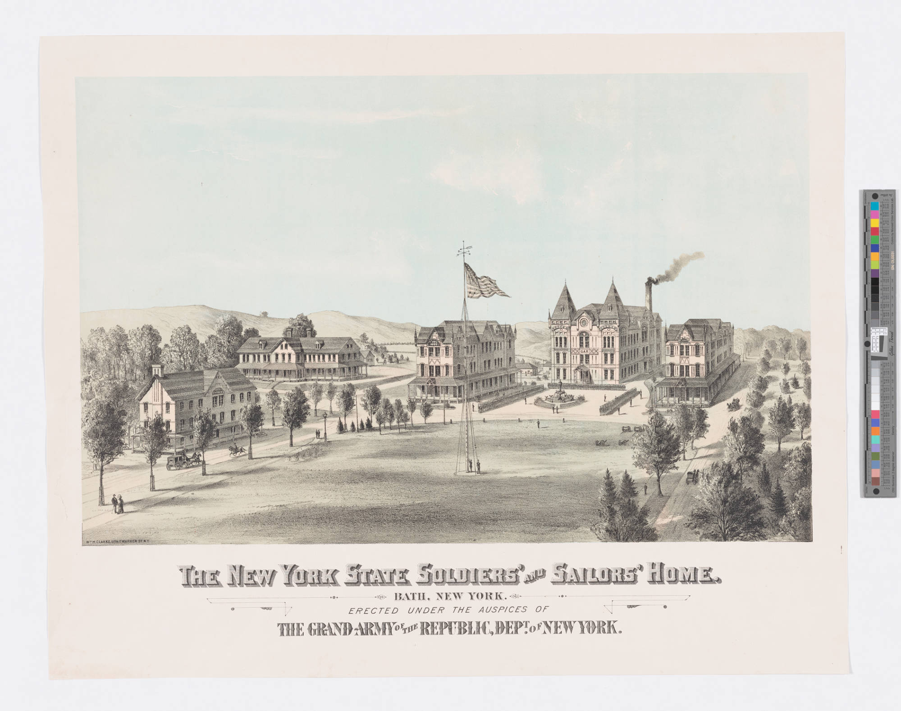

John (Ah) Hang’s (Tong Kee Hang) life offers one of the more detailed and revealing stories of a Chinese immigrant who served during the American Civil War.

::: {.quarto-figure .quarto-figure-center}
<figure class="figure">

<figcaption>John Hang, 1911.</figcaption>

</figure>
:::

<h2 class="anchored">

Basic Information

</h2>

<ul>

<li>Born: Canton, July 17, 1841</li>

<li>Service: Union Navy</li>

<li>Enlisted: July 24, 1863</li>

<li>Discharged: September 30, 1864</li>

</ul>

<h2 class="anchored">

Early Life

</h2>

Hang’s actual birth year and age was questioned during his entire life, but he alleged that he had been born in Canton, China, on July 17, 1841. He eventually made his way to the United States in 1857 at about 16 years of age. Prior to his service in the U.S. Hang claimed to work as a Steward on the vessel Shakespeare.

<h2 class="anchored">

Military Service

</h2>

::: {.quarto-figure .quarto-figure-center}
<figure class="figure">

<figcaption>John Hang, date unknown.</figcaption>

</figure>
:::

Hang enlisted on July 24, 1863, serving aboard the USS Albatross and USS Penguin. He worked as both a landsman and cabin steward, positions that placed him within the daily labor systems that sustained naval operations. In an interview given years later, Hang explains that his name was written down as “John Ah Hang” when he enlisted, but that this was the Chinese way of pronouncing it.

Hang claims that, at the time, he did not know enough about English to remember the names of the officials on the boat, but he remembered exactly what duties he completed.

While on the Albatross, Hang assisted in blockading duty around Mobile Bay for about 8-9 months before transferring to the Penguin.

There, he acted as Cabin Steward. He recalled the time that a couple of men on the ship became very sick and were taken to the hospital, and although he did not know the name of the sickness, he was sure it was not yellow fever. While landsmen performed general ship duties, cabin stewards often served officers directly. Hang remained in service until his final discharge on September 30, 1864 at Boston, Massachusetts, surviving the war and transitioning into civilian life.

<h2 class="anchored">

Postwar Life

</h2>

After the war, Hang built a life in New York City. He worked as a tobacco merchant, operating businesses on Pearl Street and Mott Street, and later resided at the Soldiers’ and Sailors’ Home as he aged.

{fig-align="center"}

His first application for a pension was successful, although there was an investigation held in 1908 after an author writing about the Chinese residents in New York requested an inquiry. This resulted in an investigator transcribing his interview with Hang in which he recounts his life story up until that point. His pension was resumed after this. His successful pension application demonstrates that he was able to secure federal recognition for his wartime service—something many immigrant veterans struggled to achieve.

<h2 class="anchored">

Historical Significance

</h2>

Yet Hang’s life also reveals the limits of that recognition. Despite his military service and long residence in the United States, he attempted to naturalize under the name William Hang and succeeded, however it was taken away for him shortly after. His experience reflects the broader exclusion of Chinese immigrants from American citizenship in the late nineteenth and early twentieth centuries.

Hang’s personal life further illustrates his integration into American society. He married twice—first to Jennie Busch in Savannah, Georgia, in 1868, and later to Maggie Duffy in 1878. Both marriages connect him to diverse immigrant communities, highlighting the interconnected social worlds of port cities like New York and Savannah. Unfortunately both of his marriages ended with him widowed, and he never remarried nor had any children.

John Hang died in Staten Island, New York, on December 3rd, 1923.

<h2 class="anchored">

<h2>Sources</h2>

<ul>

<li><a href="https://www.gothamcenter.org/blog/tong-kee-hang-a-chinese-american-civil-war-veteran-who-was-stripped-of-his-citizenship">"Tong Kee Hang"</a></li>

<li><a href="https://usdandelion.com/archives/6192">"Historical Record of Chinese Americans"</a></li>

<li><a href="https://bluegraychinese.blogspot.com/search/label/John%20%2F%20William%20Hang">"John/William Hang"</a></li>

</ul>

 

