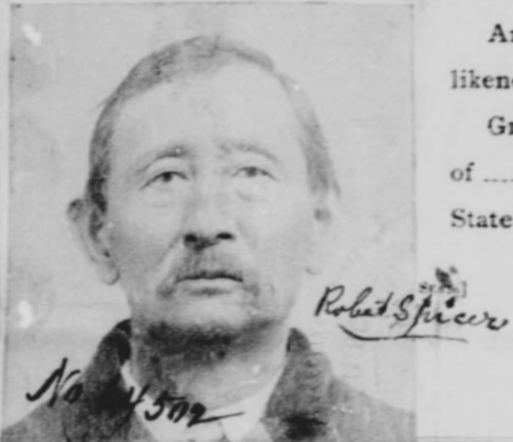
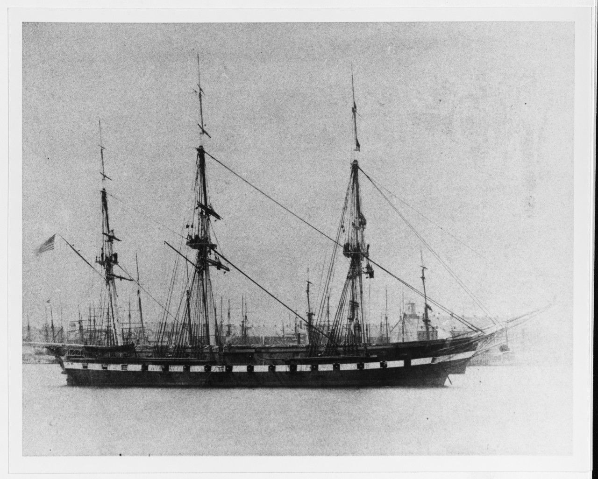
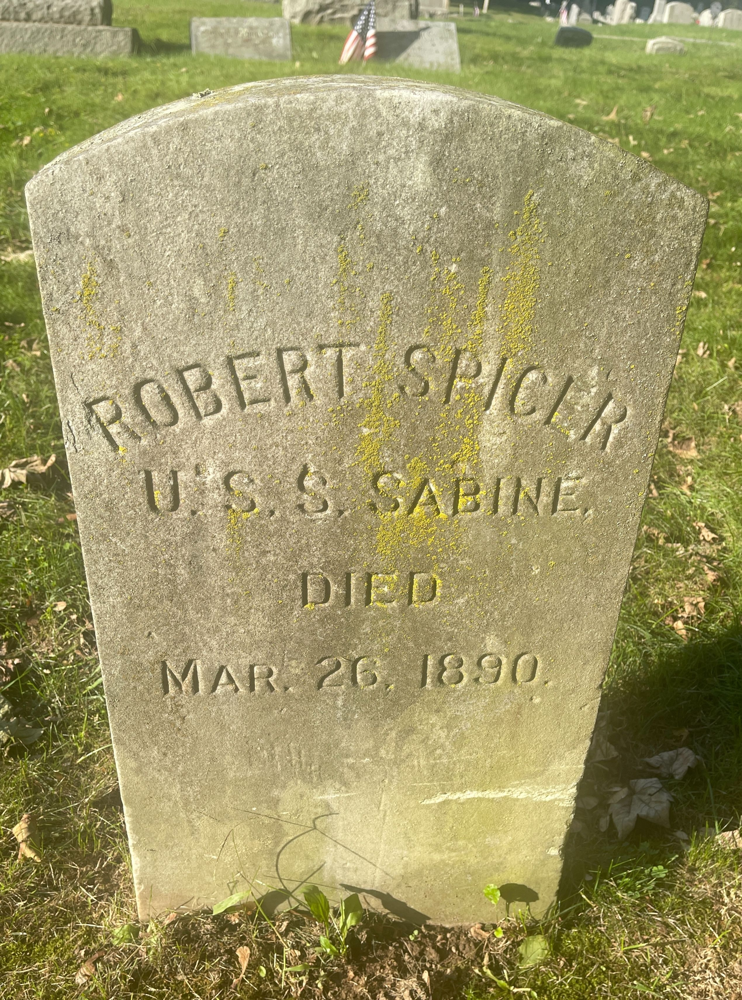

{fig-align="center"}

<h2>Basic Information</h2>

<ul>

<li>Born: Shanghai, 1842</li>

<li>Service: Union Navy</li>

<li>Enlisted: July 21, 1862</li>

<li>Discharged: July 19, 1863</li>

</ul>

<h2>Early Life</h2>

Robert Spicer was born in Shanghai, China, in 1842.

Newspaper accounts reported that he was brought to the United States in 1856 as a child by the wealthy sea-captain, Elihu Spicer, who purchased the boy from his parents in China for eight dollars. While the exact circumstances of this transaction remain difficult to verify, such arrangements were not uncommon in port communities like Mystic and New London, where sailors, merchants, and laborers regularly moved between Asia and the United States. Unfortunately, Spicer’s original Chinese name has been lost, but records show that he did adopt Capt. Spicer’s surname, and took “Robert” for his first. It was likely this coastal connection, as well as the fact that Captain Spicer himself became the captain of a Union steamship, that made enlistment in the Navy more accessible for him.

The 1860 census listed him as a seventeen-year-old laborer, showing that he began working before the outbreak of the conflict.

<h2>Military Service</h2>

Spicer eventually found himself serving in the Union Navy during the Civil War. He enlisted on July 21, 1862 in New London, Connecticut as a landsman aboard the USS Sabine, a Union vessel, and was discharged on July 19th, 1863.

{fig-align="center"}

<h2>Postwar Life</h2>

After his service, Spicer remained in Connecticut and continued working along the coast. On July 16, 1875, he married Alice Somers at St. Mark’s Church. An 1880 census lists his occupation as a fisherman, reflecting a life tied closely to maritime labor. Spicer also sought payment and recognition for his service, as in 1889, he applied for and received a federal pension.

According to a certificate later filed by his wife, he suffered for years from chronic illness, including fever, “ague”, and persistent diarrhea that she believed was brought on by his service. The couple lived in the coastal community of Noank, Connecticut for the remainder of their lives.

Alice Somers was born in 1850 in Ireland, and immigrated to the United States with her family when she was four years old. The couple did not have any children. Robert Spicer died on March 26, 1900, and newspapers remembered him as a well-known figure– nicknamed “Bob”– in the community and a respected veteran. His funeral was attended by the Grand Army of the Republic, the nation’s largest Union veteran’s association, of which Spicer was also a member. He is buried in Noank Cemetery. His wife, Alice Somers Spicer, would join him in his rest on February 24th, 1915.

{fig-align="center"}

<h2>Historical Significance</h2>

Newspaper accounts describing Spicer reveal how racial identity shaped American public perceptions of immigrant veterans. One obituary referred to him as a “naturalized Chinaman”, while another incorrectly described him as being of Japanese descent. These two descriptions alone demonstrate the uncertainty that surrounded immigrants in nineteenth-century America.

Even when discussing individuals like Spicer who lived in the United States for decades, journalists still frequently emphasized their racial identity. However, the same articles also remembered Spicer as a respected member of the community, and all fondly noted his nickname–”Bob.” He was described as being well-liked in fishing circles and honored by the Grand Army of the Republic. This recognition suggests that military service was still able to provide immigrants with some degree of legitimacy, even when the society around them viewed them as perpetual outsiders.

Through the limited documents we have, Spicer’s story can still be constructed to a fascinating degree. His life reflects the multi-facted realities faced by many immigrant veterans, and illustrates how global migration, wartime service, and local community intersected in the decades following the Civil War.

<h2>Sources</h2>

<ul>

-   [Naval enlistment record](../../images/rs_naval.jpg){target="_blank"}
-   [Pension record](https://catalog.archives.gov/id/64212672?objectPage=2){target="_blank"}

</ul>

Newspaper references

1. ["Robert Spicer’s Funeral"](https://www.newspapers.com/newspage/968766578/) *The Day*, March 29, 1900, p. 3.  
   “The funeral of the late Robert Spicer, known to every one as "Bob." was emnized at the Baptist church yesterday afternoon. The arrangements were charge of the Grand Army, of which ceased was a member. A large number friends attended who accepted this the opportunity to attest to the high esteem which they yield this departed citizen. C. Martin preached the funeral sermon and spoke most feelingly, paying just ute to the memory of one who had always lived an upright life during his many residence in this place. The interment took place in Noank cemetery.”

2. ["Robert Spicer Passed Away While Putting on His Clothing"](https://www.newspapers.com/newspage/968766399/) *The Day*, March 26, 1900, p. 3.  
   “Robert Spicer, a well known figure of place, dropped dead at his home on street, early this morning. He had no former signs of illness and had made rangements for a fishing trip today one of the local fishermen. He was for at the appointed hour but was partly dressed, lying on a sofa but was extinet. Mr. Spicer, more familiarly known "Bob," was of Japanese descent and brought here from that country when small, by the late Capt. Elibu Spicer Mystic, who was then on a foreign It was so long ago that Bob has forgotten his mother tongue and spoke English language almost perfectly. original name was never known and correct age has always been a matter doubt, but when this country was he took the Spicer name with the name of Robert. He has always followed the water in ferent capacities but chiefly as steward was always well liked by his employers because of his faithfulness. He enlisted during the civil war and having served country honorably he received a small sion, which was his main support in latter years of his life "Bob" was a friend to every one and return every one was a friend to him. was quiet in his ways and liked by one and will be missed in fishing circles. He was a member in good standing of Grand Army post at Mystic, by which will probably be buried. He leaves a mourn his loss”

3. ["Naturalized Chinaman Who Served in Civil War"](https://www.newspapers.com/newspage/968766399/) *The Journal*, March 26, 1900, p. 1.  
   “Spicer was found dead in bed at his home in Noank early this morning. Heart failure is believed to have been the cause of death. Spicer, was a Chinaman and was brought to this country in 1856 by Captain Spicer, a millionaire shipowner and sea captain of this place, who purchased the boy from his parents in China. The amount involved in the transaction was \$8. When the Civil war broke out the young man enlisted in the United States navy and served continuously until peace was restored. For many years Mr. Snider had enjoyed the rights of citizenship. He is survived by a widow.”
