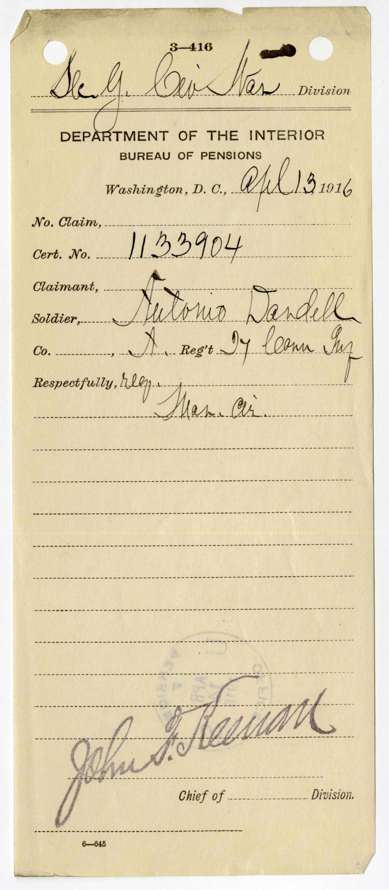
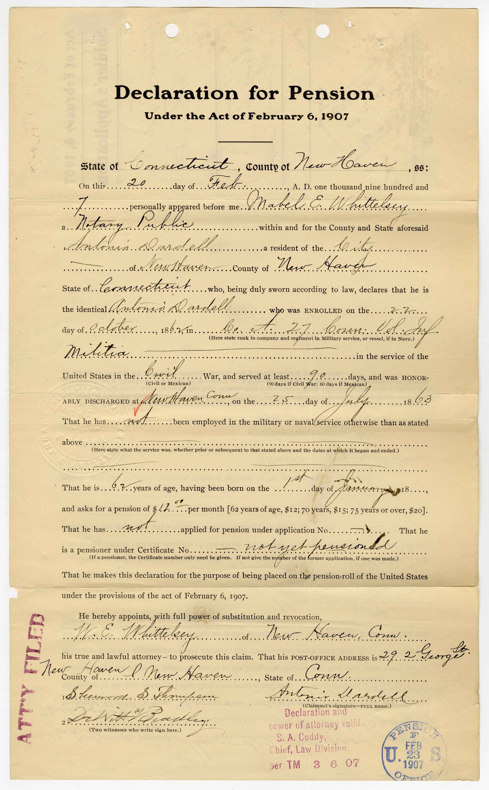
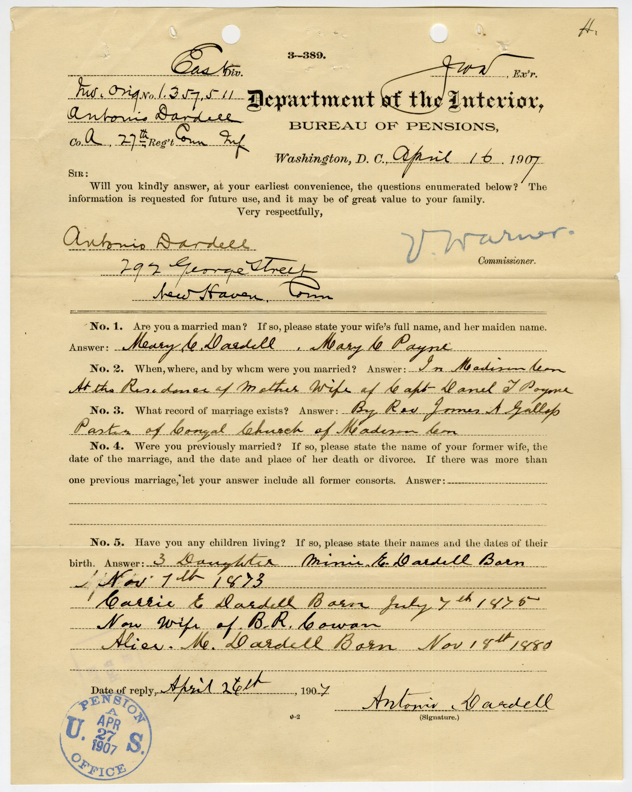

This project is built from a diverse archival base that documents the presence of Chinese individuals in the United States during the Civil War era. Because these individuals rarely appear in a single, cohesive record, the project draws on multiple source types to reconstruct their lives across military service, migration, and postwar experience.

------------------------------------------------------------------------

### Military and Naval Records

The foundation of this project lies in **Union Army and Navy enlistment records**, which provide the most direct evidence of Chinese participation in the Civil War. These records include:

-   Enlistment dates and locations\
-   Rank at entry and discharge\
-   Ship assignments (for naval personnel)\
-   Basic physical descriptions and demographic markers

Naval records are particularly important, as many Chinese individuals served in the Union Navy, often in roles such as landsmen or stewards. These documents establish not only military service, but also patterns of mobility, labor, and incorporation into federal structures.

## Pension Files

**Pension records** are among the richest sources in this project. Unlike enlistment records, which are largely administrative, pension files often contain:

-   Personal affidavits from veterans
-   Testimony from family members, shipmates, or community members
-   Medical evaluations and documentation of disability
-   Marriage and death records

These files extend beyond wartime service, allowing the reconstruction of postwar lives, including family formation, economic conditions, and long-term health. At the same time, they reflect the bureaucratic requirements of the federal government, as applicants were required to provide evidence in forms that aligned with state expectations.

### Example: Antonio Dardell Pension File (27th Connecticut Infantry)

The pension file of Antonio Dardell illustrates the range of evidence pension records can contain. Dardell, who served in Company A of the 27th Connecticut Infantry, applied for a pension decades after his Civil War service. His file includes official identification forms, a formal declaration for pension, and supporting correspondence and personal testimony, demonstrating both the depth of personal information preserved in these records and the evidentiary burden placed on veterans seeking recognition.

::: {.callout-note appearance="simple"}
**Why this source matters**

These pages show how pension files bridge bureaucratic recordkeeping and personal testimony. Together, they document service, formal claims-making, and the human witnesses required to support recognition.
:::

To explore the full range of documents contained in this record, view the complete pension file here:\
[Full Pension File (PDF)](../documents/Antonio_Dardell_Pension.pdf)

### Selected Pages from the Pension File

 

 

  <small>For another example of what pension records can reveal, see [John Hang](soldier_profiles/john-hang.qmd).</small>

------------------------------------------------------------------------

### Census Records

Federal census data is used to trace individuals across time, particularly in the decades following the war. These records provide:

-   Occupations and economic status\
-   Household composition\
-   Residential patterns within port cities and coastal communities

Census data helps situate Chinese veterans within broader social and geographic contexts, revealing how military service intersected with labor, migration, and community formation.

------------------------------------------------------------------------

### Ship Logs and Maritime Records

Ship logs and naval documentation provide critical insight into the movements and labor structures of Chinese sailors. These sources include:

-   Crew lists and ship assignments\
-   Records of voyages and ports of call\
-   Notes on discipline, labor, and onboard conditions

Because many Chinese individuals entered military service through maritime labor networks, these records help connect Civil War service to broader transnational patterns of movement.

------------------------------------------------------------------------

### Newspapers and Public Discourse

Nineteenth-century newspapers are used to contextualize how Chinese individuals were represented in public discourse during and after the Civil War. These sources include:

-   Reports on military service and naval activity\
-   Local coverage of Chinese communities\
-   Editorials and commentary reflecting racial attitudes

While Chinese soldiers are rarely the central focus of these articles, newspapers provide insight into the broader cultural environment in which they lived and served. To see how this discourse affected an individual's memory, see [Robert Spicer](soldier_profiles/robert-spicer.qmd).

------------------------------------------------------------------------

### Secondary Sources

In addition to archival materials, this project draws on a body of historical scholarship that provides context for understanding race, migration, and citizenship in the nineteenth-century United States.

Key works:

Arielli, Nir, and Collins, Bruce, eds. *Transnational Soldiers: Foreign Military Enlistment in the Modern Era*. Basingstoke, UK: Palgrave Macmillan UK, 2012. 

Bailey, Anne J. *Invisible Southerners : Ethnicity in the Civil War.* Athens: University of Georgia Press, 2006.

Black, Jeremy. *War in the 19th Century, 1800-1914.* Cambridge: Polity, 2009.

Blight, David W, and American Council of Learned Societies. *Race and Reunion the Civil War in American Memory*. Cambridge, Mass: Belknap Press of Harvard University Press, 2003.

Grant, Susan-Mary “When Is a Nation not a Nation? The Crisis of American Nationality in the Mid-Nineteenth Century,” Nations and Nationalism 2, no. 1 (1996): 105–29

Lee, Erika. *At America’s Gates: Chinese Immigration during the Exclusion Era*. Chapel Hill, NC: University of North Carolina Press, 2003.

Lew-Williams, Beth. *The Chinese Must Go: Chinese, Exclusion, and the Making of the Alien in America*. Cambridge, MA: Harvard University Press, 2018.

Salyer, Lucy E. *Laws Harsh as Tigers: Chinese Immigrants and the Shaping of Modern Immigration Law*. Chapel Hill, NC: University of North Carolina Press, 1995.

These works provide historical context and help situate the project within broader scholarly conversations, but the core of the analysis remains grounded in the archival record.

------------------------------------------------------------------------

### Bringing the Sources Together

No single source fully captures the experiences of Chinese Civil War participants. Instead, this project relies on the **intersection of multiple record types** to reconstruct individual lives. Military records establish service, pension files provide narrative depth, census data traces continuity, and newspapers reveal the broader cultural context.

Taken together, these sources allow for a more complete account of individuals who are otherwise only partially visible in the historical record.
