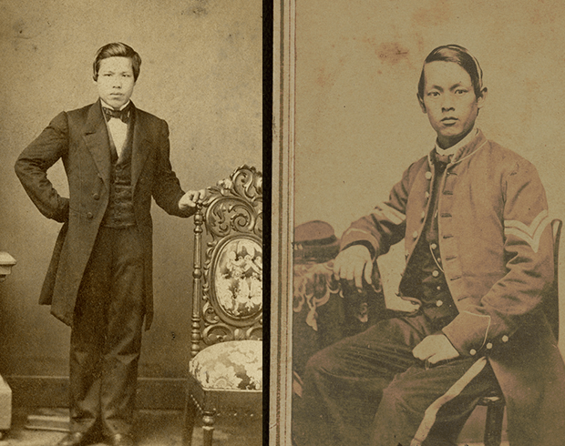
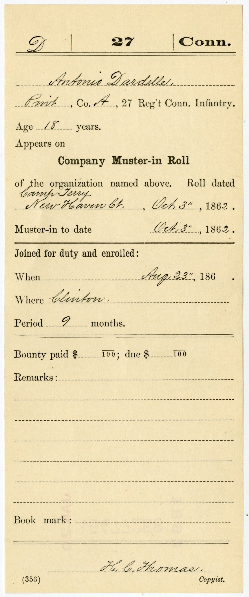

How did military service make Chinese men visible within a system that often excluded them? During the Civil War era, the act of enlistment entered them into bureaucratic systems that recorded, categorized, and, in some cases, fixed their identities within official state structures.

<h2>Race and Bureaucratic Systems</h2>

In nineteenth-century America, race was not only a social category but also an administrative one. Government institutions relied on documentation—enlistment papers, service records, census schedules, and pension files—to classify individuals and organize populations. These systems translated lived identities into standardized categories that could be recorded and managed.

For Chinese men, this process was uneven and often inconsistent. Racial identification could shift depending on the context, the recorder, or the purpose of the document. At the same time, the very act of being recorded placed these men within official systems that might otherwise have overlooked or excluded them.

<h2>Military Records as Sites of Recognition</h2>

Military service created new opportunities for Chinese men to enter these bureaucratic systems. Enlistment records required the documentation of key details such as name, age, place of birth, and occupation. Service records and muster rolls extended this documentation across time, while pension files could preserve information decades after the war.

[{width="346"}](https://catalog.archives.gov/id/146919982?objectPage=5)

These records helped produce an identity. By assigning names, categories, and descriptors to individuals, military documentation contributed to the process of making Chinese men legible to the state. In this way, the military functioned not only as a site of labor and service, but also as a site of recognition and classification.

<h2>Individual Records and Archival Traces</h2>

The impact of this process can be seen in the surviving records of individual soldiers. The extensive documentation connected to <a href="../soldier_profiles/john-ah-hang.html">John (Ah) Hang</a>, including his pension file and later interview, provides a rare example of how bureaucratic systems could preserve a detailed account of a Chinese life across multiple decades.

<h2>Recognition and Its Limits</h2>

Despite this increased visibility, recognition within bureaucratic systems did not guarantee broader social or legal inclusion. Chinese men who served in the military were still subject to exclusionary laws, racial discrimination, and shifting definitions of citizenship. Being recorded did not necessarily mean being accepted.

At the same time, the existence of these records complicates narratives of complete exclusion. The presence of Chinese men in military and administrative documents reveals moments in which they were acknowledged, categorized, and incorporated—however imperfectly—into the structures of the state.

<h2>Conclusion</h2>

Military service during the Civil War made Chinese men visible within systems that both recognized and constrained them. Through enlistment records, service documentation, and pension files, these individuals entered bureaucratic frameworks that shaped how their identities were recorded and remembered. Their experiences demonstrate that recognition was not a fixed condition, but a process shaped by the interaction of race, institutions, and historical circumstance.

<h2>Sources and Further Reading</h2>

<ul>

<li>McClain, Charles J. *In Search of Equality : The Chinese Struggle against Discrimination in Nineteenth-Century America.* Edited by Charles J. McClain. Berkeley, CA: University of California Press, 1996. doi:10.1525/9780520917811.</li>

<li>Choy, Philip P, Lorraine Dong, and Marlon K Hom. *Coming Man : 19th Century American Perceptions of the Chinese*. First University of Washington Press paperback edition. Seattle: University of Washington Press, 1995.</li>

<li>McCunn, R.L. *Chinese Yankee: A True Story from the Civil War*. Design Enterprises of San Francisco, 2014. <https://books.google.com/books?id=vgjcoQEACAAJ.></li>

</ul>
