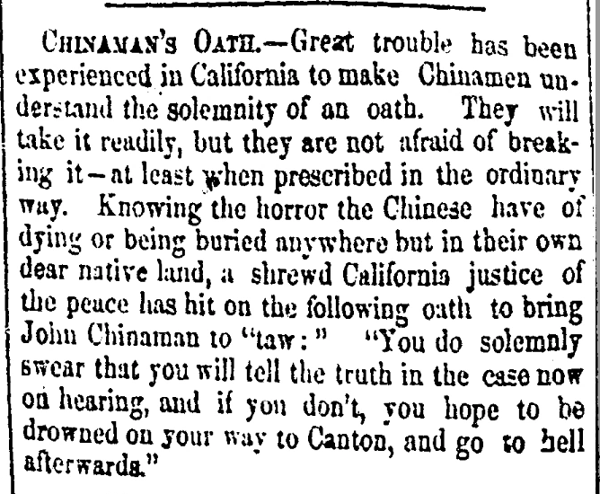
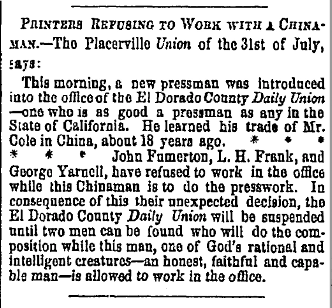

How were Chinese immigrants understood by the Americans around them during the Civil War era? Public perceptions of Chinese men were shaped not only by direct interaction, but by newspapers, popular discourse, and racialized assumptions that framed how their presence was interpreted within American society.

<h2>Public Discourse and Racial Assumptions</h2>

In the mid-nineteenth century, Chinese immigrants were often depicted through a limited set of racialized stereotypes. Newspapers, political rhetoric, and popular writing frequently portrayed Chinese individuals as foreign, unassimilable, or morally suspect. These representations shaped how Americans understood Chinese presence, even in places where direct interaction was limited.

[{fig-align="center" width="415"}](https://link-gale-com.ezproxy.lib.vt.edu/apps/doc/GT3010870388/NCNP?u=viva_vpi&sid=bookmark-NCNP&pg=1&xid=385555e2)

Such perceptions were not uniform, but they established a framework within which Chinese men were evaluated. Ideas about labor, gender roles, and cultural difference influenced how Chinese immigrants were viewed and how their actions were interpreted by broader society.

<h2>Perception and Military Service</h2>

Military service placed Chinese men in a position that could both reinforce and challenge existing assumptions. On one hand, enlistment demonstrated participation in a national cause, potentially complicating narratives that framed Chinese immigrants as outsiders. On the other hand, service did not necessarily alter the racial frameworks through which they were viewed.

Newspapers and public commentary rarely centered Chinese soldiers, and when they did, their presence was often filtered through existing expectations about race and difference. As a result, even acts of service could be interpreted in ways that reinforced rather than disrupted prevailing perceptions.

<h2>Perception and Its Consequences</h2>

Public perceptions had tangible effects on the lives of Chinese immigrants. Racialized assumptions influenced not only social attitudes but also legal and institutional responses, shaping the boundaries of inclusion and exclusion in American society. These perceptions contributed to the conditions under which Chinese men served, worked, and attempted to build lives in the United States.

[{fig-align="center"}](https://link-gale-com.ezproxy.lib.vt.edu/apps/doc/GT3000054712/NCNP?u=viva_vpi&sid=bookmark-NCNP&pg=2&xid=623cd8a2)

At the same time, the presence of Chinese soldiers complicates these narratives. Their participation in the Civil War demonstrates that, despite prevailing stereotypes, Chinese men were actively engaged in the political and military life of the nation.

<h2>Conclusion</h2>

American perceptions of Chinese immigrants during the Civil War era were shaped by a combination of racial assumptions, public discourse, and limited understanding. While these perceptions often constrained how Chinese men were viewed and treated, they did not fully define their experiences. By examining both representation and lived reality, this project reveals the gap between perception and participation, highlighting the complexity of Chinese presence in nineteenth-century America.

<h2>Sources and Further Reading</h2>

<ul>

<li>Lee, Erika. “The ‘Yellow Peril’ and Asian Exclusion in the Americas.” Pacific Historical Review 76, no. 4 (2007): 537–62. doi:10.1525/phr.2007.76.4.537.</li>

<li>Gyory, Andrew. *Closing the Gate : Race, Politics, and the Chinese Exclusion Act.* 1st ed. Chapel Hill: University of North Carolina Press, 1998.</li>

<li>Grant, Susan-Mary “When Is a Nation not a Nation? The Crisis of American Nationality in the Mid-Nineteenth Century,” Nations and Nationalism 2, no. 1 (1996): 105–29</li>

<li>Choy, Philip P, Lorraine Dong, and Marlon K Hom. *Coming Man : 19th Century American Perceptions of the Chinese*. First University of Washington Press paperback edition. Seattle: University of Washington Press, 1995.</li>

<li>Hirota, Hidetaka. “Introduction: Transpacific Connections in the Civil War Era.” The Journal of the Civil War Era 13, no. 4 (2023): 431–43.</li>

</ul>
